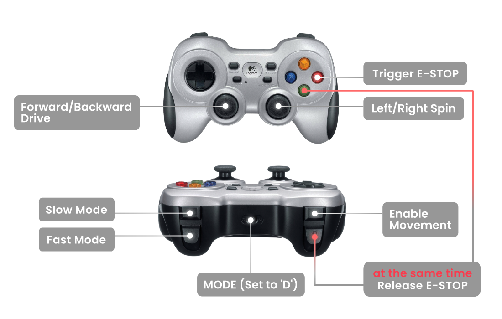

# Joy2Twist

Dockerized ROS node allowing control of ROS-powered mobile robots with Logitech F710 gamepad. Joy2Twist node is converting `sensor_msgs/Joy` message to `geometry_msgs/Twist` in order to provide velocity commands for the mobile robot. Therefore this package is compliant (but not supported by Husarion) with any other gamepad controller which is able to publish the `sensor_msgs/Joy` message.

## Setup joy

Connect joy via nano USB receiver and make sure it is in **DirectInput Mode** (switch in front o the pad with letters **D** and **X**, select **D**).

To test if joy works, use `jstest /dev/input/js0`.
If the output is:

```
jstest: No such file or directory
```

See `ls /dev/input | grep js` and find your joy number. If it differs, apply changes in *compose.yaml* and launch file.

## Button mapping



| Button |     Function      |
| :----: | :---------------: |
|  `LB`  |  enable driving   |
|  `RB`  | slow driving mode |
|  `RT`  | fast driving mode |

If neither `RB` nor `RT` is pressed, the robot operates in *regular* driving mode.

To drive robot use sticks.
By default, linear `X` and `Y` are held by the left stick. Angular `Z` is controlled with the right stick.

### Emergency stop

| Button |      Function       |
| :----: | :-----------------: |
|  `A`   |    Reset E-stop     |
|  `B`   |   Trigger E-stop    |
|  `LT`  | Enable E-stop reset |

> [!NOTE] 
> Handle of robot's emergency stop is available only when `~e_stop/present` parameter is set true. This functionality will work with any robot configured as follows:
> - publishes robot's E-stop state uisng ROS topic of type `std_msgs/Bool`.
> - allows resetting robot's E-stop using ROS service of type `std_srvs/Trigger`.
> - allows triggering robot's E-stop using ROS service of type `std_srvs/Trigger`.
> 
> Topic and services names can be configured using ROS parameters, see [Parameters](#parameters) for more info.

---
## ROS node API

ROS node is translating `/joy` topic to `/cmd_vel` topic.


### Publish

- `/cmd_vel` *(geometry_msgs/Twist)*

### Subscribe

- `/joy` *(sensor_msgs/Joy)*

### Parameters

Following parameters change joystick axes mapped to given robot axes of freedom. For more information about parameter values, refer to the joy package [wiki page](http://wiki.ros.org/joy#Logitech_Wireless_Gamepad_F710_.28DirectInput_Mode.29).

- `~axis_linear_x`      *(int, default: 3)*
- `~axis_linear_y`      *(int, default: 2)*
- `~axis_angular_z`     *(int, default: 0)*

The robot can be operated at 3 scales of speed depending on pressed buttons. It's possible to adjust velocity scaling factors using a [config file](./joy2twist/config/joy2twist.yaml). The Units are m/s for linear movement and rad/s for angular movement.

- `fast`    *(float, default: 1)*
- `regular` *(float, default: 0.5)*
- `slow`    *(float, default: 0.2)*

The node can be configured using parameters described below to work with robots equipped with an E-stop interface. An example configuration for a robot with an E-stop interface can be found in [panther config file](./joy2twist/config/joy2twist_panther.yaml).

- `~e_stop/present`         *(bool, default: false)*
- `~e_stop/topic`           *(string, default: e_stop)*
- `~e_stop/reset_srv`       *(string, default: e_stop_reset)*
- `~e_stop/trigger_srv`     *(string, default: e_stop_trigger)*

## Docker image

[](https://github.com/husarion/joy2twist/actions/workflows/build-docker-image.yaml)

| ROS2 distro |   Supported architectures    |
| :---------: | :--------------------------: |
| `galactic`  | `linux/amd64`, `linux/arm64` |
|  `humble`   | `linux/amd64`, `linux/arm64` |

Available on [Docker Hub](https://hub.docker.com/r/husarion/joy2twist/tags)

## Demo

### Controlling ROSbot 2 with a Logitech F710 gamepad

Connect Logitech F710 dongle to the ROSbot 2 and run (on ROSbot):

```bash
cd joy2twist/demo/single_robot
docker compose -f compose.rosbot.melodic.yaml up
 ```

### Different namespace demo with a Logitech F710 gamepad

Connect a Logitech F710 USB dongle to your PC. Clone this repo to your PC and go to the `joy2twist/demo/` directory and run in a separate terminal:

```bash
./sync_with_robot.sh <YOUR_ROSBOT_IP>
```

Change the namespace in the `multiple_robots/.env` file:

```bash
ROS_NAMESPACE=robot1
```

Now SSH to your robot:

```bash
ssh husarion@<YOUR_ROSBOT_IP>
```

Go to the folder `/home/husarion/demo/multiple_robots`, and launch the container for ROSbot:

```bash
docker compose -f compose.rosbot2r.yaml up
```

> **Topic filtering**
>
> If you will then check on the PC the available ROS 2 nodes you will get:
> 
> ```bash
> $ ros2 topic list
> /parameter_events
> /robot1/cmd_vel
> /rosout
> ```
> 
> Note that nly the single `/robot1/cmd_vel` topic is available outside the robot thanks to the configuration from the `ros2router_config.yaml` file.
>
> To control the robot by using the teleop, just run: `ros2 run teleop_twist_keyboard teleop_twist_keyboard __ns:=/robot1`

To run the `joy2twist` container execute the following command on your PC in the `joy2twist/demo/multiple_robots` directory:

```
docker compose -f compose.pc.yaml up
```
